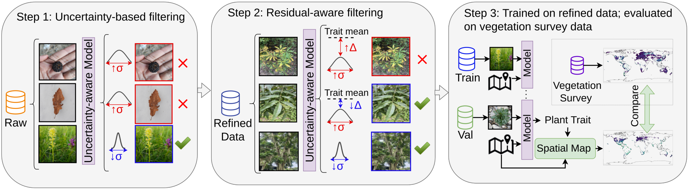

# PlantTraitNet: An Uncertainty-Aware Multimodal Framework for Global-Scale Plant Trait Inference from Citizen Science Data


<!-- *Overview of the pipeline of PlantTraitNet* -->
<p align="center">
  
</p>
Figure 1: Overview of the pipeline. We filter weakly labeled citizen science data (Raw data) based on high model uncertainty
(Step 1) and large residuals from species trait medians (Step 2). We use this refined data for training the models (Step 3), which
are evaluated by comparing spatially aggregated predictions (1° resolution) against overlapping vegetation surveys (sPlotOpen).

## Overview

PlantTraitNet is a multi-modal, multi-task deep learning framework that predicts key plant traits—height, leaf area, specific leaf area, and nitrogen content—from citizen science photos using weak supervision. By aggregating these predictions globally, it produces high-resolution trait maps validated against sPlotOpen

## Setup
```bash
conda create -n planttraitnet python=3.10
pip install -r requirements.txt

#To install DepthAnything V2 (https://github.com/DepthAnything/Depth-Anything-V2)
git clone https://github.com/DepthAnything/Depth-Anything-V2
cd Depth-Anything-V2
pip install -r requirements.txt

```


## Training

You first need to download the PlantTraitNet dataset. This can be done directly via [Hugging Face](https://huggingface.co/datasets/ayushi3536/PlantTraitNet), using the `huggingface_hub` library:
```python
from huggingface_hub import snapshot_download
snapshot_download("ayushi3536/PlantTraitNet", local_dir='.', repo_type='dataset')
```
Alternatively you can clone the repository:
```bash
git clone https://huggingface.co/datasets/ayushi3536/PlantTraitNet
```

Now, to train **PlantTraitNet** models, set the paths correctly, adapt training configs in `/configs/default.yaml` and train PlantTraitNet by running:
```bash

python python src/train.py --cfg /src/configs/default.yml --output /path/to/output
```


## Pretrained Models
This can be done directly via [Hugging Face](https://huggingface.co/ayushi3536/PlantTraitNet/tree/main, using the `huggingface_hub` library:
```python
from huggingface_hub import snapshot_download
snapshot_download("ayushi3536/PlantTraitNet", local_dir='.', repo_type='model')
```

## Citation
Coming soon: Citation of published verison
```bibtex
@misc{sharma2025planttraitnetuncertaintyawaremultimodalframework,
      title={PlantTraitNet: An Uncertainty-Aware Multimodal Framework for Global-Scale Plant Trait Inference from Citizen Science Data}, 
      author={Ayushi Sharma and Johanna Trost and Daniel Lusk and Johannes Dollinger and Julian Schrader and Christian Rossi and Javier Lopatin and Etienne Laliberté and Simon Haberstroh and Jana Eichel and Daniel Mederer and Jose Miguel Cerda-Paredes and Shyam S. Phartyal and Lisa-Maricia Schwarz and Anja Linstädter and Maria Conceição Caldeira and Teja Kattenborn},
      year={2025},
      eprint={2511.06943},
      archivePrefix={arXiv},
      primaryClass={cs.CV},
      url={https://arxiv.org/abs/2511.06943}, 
}
```

